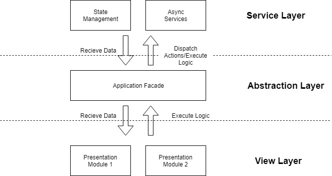

#Introduction
This application is used to fetch and display weather data

#Technical Stack Used
Angular 11.x

#Architecture followed 
The architecture followed uses best principles for scalability in order to maintain sustainable development speed and ease of adding new features in the long run.



View layer:- is responsible to present and to delegate user’s actions to the service layer, through the abstraction layer .

Abstraction layer:- is responsible for a decoupling the view layer from the service layer and also has its very own defined responsibilities.

Service layer:- is responsible for data manipulation and outside world communication happen here

#Tree Structure
This tree represents the directories created.
````
.
├── weather-app-folder
└── src
├── app
│   ├── core
│   ├── data
│   ├── layout
│   ├── module
│   └── shared
└── styles
````
# NgWeatherApp

This project was generated with [Angular CLI](https://github.com/angular/angular-cli) version 11.2.3.

## Development server

Run `ng serve` for a dev server. Navigate to `http://localhost:4200/`. The app will automatically reload if you change any of the source files.

## Code scaffolding

Run `ng generate component component-name` to generate a new component. You can also use `ng generate directive|pipe|service|class|guard|interface|enum|module`.

## Build

Run `ng build` to build the project. The build artifacts will be stored in the `dist/` directory. Use the `--prod` flag for a production build.

## Running unit tests

Run `ng test` to execute the unit tests via [Karma](https://karma-runner.github.io).

## Running end-to-end tests

Run `ng e2e` to execute the end-to-end tests via [Protractor](http://www.protractortest.org/).

## Further help

To get more help on the Angular CLI use `ng help` or go check out the [Angular CLI Overview and Command Reference](https://angular.io/cli) page.
