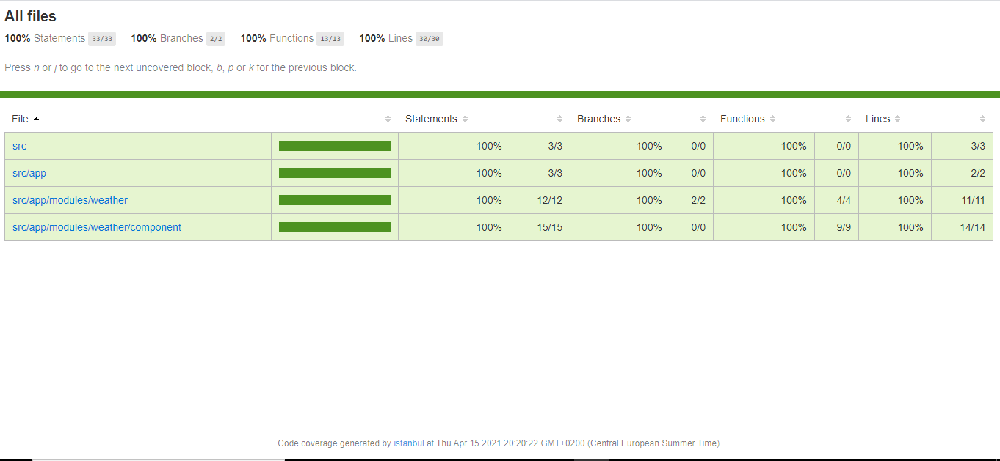

## Introduction

This is a SPA(Single Page Application) based on Angular framework. This application is used to fetch and display weather data using the open weather data APIs.
It shows the five European cities(Amsterdam, Berlin, Paris, Rome, Zurich) average temperature with wind speed in a tiles view. When user clicks on the tile, 
It shows the weather forecast for next few hours(next 12 hours in the intervals of 3 hours) in terms of temperature, wind speed and details of the respected city.

You can find the Open Weather Data API here - https://openweathermap.org/current,
You have to register and subscribe in order to use and get the API key which is required query parameter of the open weather data api.


## Technical Stack Used

Framework - Angular 11.2.x

UI Component Library - Angular Material 11.2.x

Runtime Environment - Node.js 14.15.x

## Architecture followed

The architecture followed uses best principles for scalability in order to maintain sustainable development speed and ease of adding new features in the long run.


View layer - is responsible to present and to delegate user’s actions to the service layer, through the abstraction layer .

Abstraction layer - is responsible for a decoupling the view layer from the service layer and also has its very own defined responsibilities.

Service layer - is responsible for data manipulation and outside world communication happen here

## Tree Structure

This tree represents the directories created.
````
.
├── weather-app-folder
└── src
├── app
│   ├── core
│   ├── data
│   ├── layout
│   ├── module
│   └── shared
└── styles
````
## NgWeatherApp

This project was generated with [Angular CLI](https://github.com/angular/angular-cli) version 11.2.3.

## Development server

Run `ng serve` for a dev server. Navigate to `http://localhost:4200/`. The app will automatically reload if you change any of the source files.

## Code scaffolding

Run `ng generate component component-name` to generate a new component. You can also use `ng generate directive|pipe|service|class|guard|interface|enum|module`.

## Build

Run `ng build` to build the project. The build artifacts will be stored in the `dist/` directory. Use the `--prod` flag for a production build.

## Running unit tests

Run `ng test` to execute the unit tests via [Karma](https://karma-runner.github.io).

## Check code coverage report

Run `ng test`/`ng test --no-watch --code-coverage`.

Find the latest code coverage report below



## Running end-to-end tests

Run `ng e2e` to execute the end-to-end tests via [Protractor](http://www.protractortest.org/).

## Checkout the Documenting Angular apps using CompoDoc -

While you can use TypeDoc to document Angular apps, it will treat your code as any other plain TypeScript app. That means no Angular specific documentation. 
But there is a whole lot to be documented. [Compodoc](https://compodoc.app/) solves this, it is focused on Angular apps specifically giving you a much more tailored solution.

Run `npm run compodoc` to see the Angular specific documentation.

## Further help

To get more help on the Angular CLI use `ng help` or go check out the [Angular CLI Overview and Command Reference](https://angular.io/cli) page.
